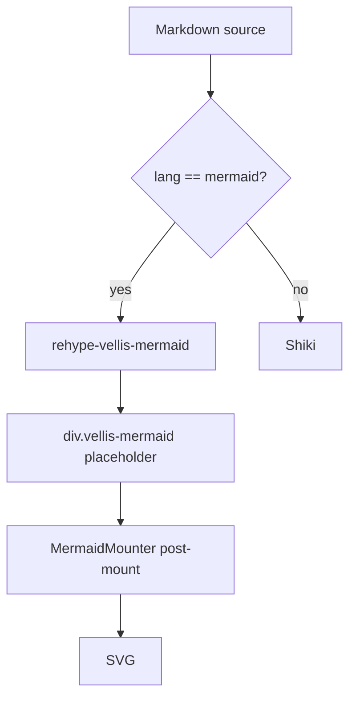
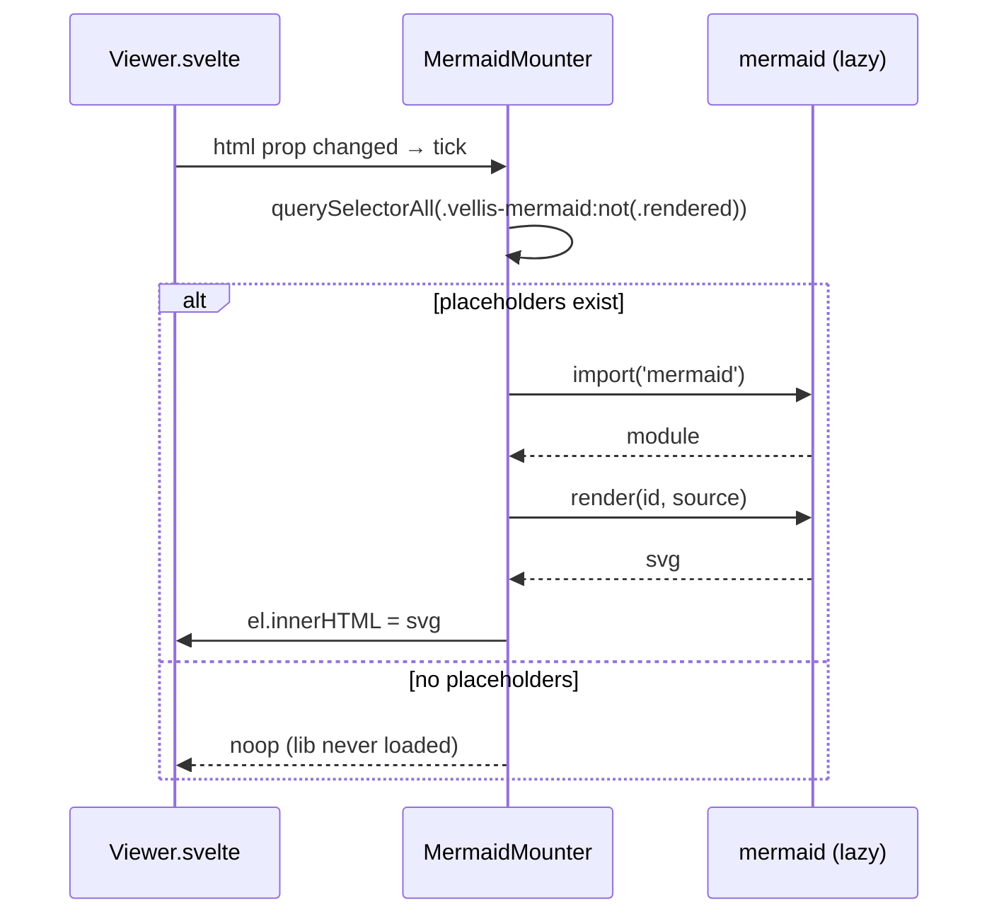

# Vellis Markdown テストファイル

このファイルは Vellis の Markdown レンダリングおよび CSP (MR !10) の動作確認用サンプルです。
各セクションを目視で確認し、期待通りに表示されればレンダリング経路と CSP 設定が両立しています。

## 1. 見出し

# H1 (トップレベル)
## H2
### H3
#### H4
##### H5
###### H6

## 2. インライン装飾

- **太字** (bold)
- *斜体* (italic)
- ***太字 + 斜体***
- ~~打ち消し線~~ (GFM)
- `インラインコード`
- 通常テキストと <kbd>Cmd</kbd>+<kbd>C</kbd> のような HTML ベースの装飾

## 3. 段落と改行

段落は空行で区切られます。
同じ段落内の改行は半角スペースで連結されます。

次の段落。ここに長い文章を書いて折り返しの挙動を確認します。Vellis は AI 生成の
Markdown を快適に閲覧することを目的としているため、長い段落でも行間が詰まりすぎず、
読みやすい行長であることを目視確認してください。

## 4. リスト

### 順序なし

- 項目 A
- 項目 B
  - ネスト B-1
  - ネスト B-2
    - さらに深い B-2-a
- 項目 C

### 順序あり

1. First
2. Second
   1. Sub 2.1
   2. Sub 2.2
3. Third

### タスクリスト (GFM)

- [x] 完了したタスク
- [x] もう一つ完了
- [ ] 未完了のタスク
- [ ] さらに未完了

## 5. コードブロック (Shiki シンタックスハイライト)

### TypeScript

```typescript
type Entry = {
  uri: string;
  name: string;
  kind: 'file' | 'dir' | 'symlink';
};

async function fetchChildren(uri: string): Promise<Entry[]> {
  const res = await invoke<Entry[]>('list_dir', { uri });
  return res;
}
```

### Rust

```rust
pub async fn install_cli() -> Result<InstallCliResult, String> {
    let exe = std::env::current_exe().map_err(|e| e.to_string())?;
    let exe = exe.canonicalize().unwrap_or(exe);
    let home = std::env::var_os("HOME").ok_or("HOME not set")?;
    let target_dir = PathBuf::from(&home).join(".local").join("bin");
    let target = target_dir.join("vellis");

    std::fs::create_dir_all(&target_dir).map_err(|e| e.to_string())?;
    std::os::unix::fs::symlink(&exe, &target).map_err(|e| e.to_string())?;
    Ok(InstallCliResult {
        target_path: target,
        source_path: exe,
        target_dir_on_path: true,
    })
}
```

### Bash

```bash
# 動作確認コマンド
vellis --version
vellis .
vellis README.md
vellis --install-cli
```

### JSON

```json
{
  "security": {
    "csp": "default-src 'self'; script-src 'self'"
  }
}
```

### プレーンテキスト (言語指定なし)

```
これは言語指定のないコードブロック。
モノスペースで表示されますが、ハイライトは入りません。
```

## 6. テーブル (GFM)

| # | 機能 | 状態 | バージョン |
|---|---|---|---|
| 1 | ローカル Markdown 閲覧 | ✅ | v0.1.0 |
| 2 | ツリー表示 Explorer | ✅ | v0.1.0 |
| 3 | フォルダ選択ダイアログ | ✅ | v0.1.0 |
| 4 | `--install-cli` + メニュー | ✅ | v0.1.1 |
| 5 | SSH リモート | ❌ | Phase 2 |
| 6 | Mermaid / KaTeX | ❌ | Phase 2 |

### 整列指定

| 左寄せ | 中央寄せ | 右寄せ |
|:---|:---:|---:|
| a | b | c |
| 長い文字列 | 中央 | 42 |

## 7. 引用

> Vellis は AI が大量生成する Markdown ファイルを閲覧するための、軽量・高速・読み取り専用デスクトップアプリである。

> ネストした引用も可能:
>
> > 深い引用。
> > 複数行。

## 8. 水平線

区切り線の上---

---

区切り線の下

## 9. リンク

### 外部リンク (tauri-plugin-opener が OS デフォルトに委譲)

- [Vellis リポジトリ](https://gitlab.com/firstfournotes/products/vellis)
- [Tauri 公式](https://v2.tauri.app/)
- [markdown-it](https://github.com/markdown-it/markdown-it)
- [Shiki](https://shiki.style/)

### Autolink (GFM)

https://example.com
<mailto:someone@example.com>
<https://anthropic.com>

### 相対リンク (同じ root 配下の別 Markdown)

- [README](../README.md)
- [アーキテクチャ文書](../docs/architecture.md)
- [要件定義](../docs/requirements.md)

## 10. 画像

### 相対パスのローカル画像 (vellis-asset:// 経由で取得)


上の画像が表示されなければ `img-src vellis-asset:` の CSP ディレクティブが効いていない可能性があります。

## 11. 脚注 (markdown-it-footnote)

Vellis は単一インスタンスアプリ[^1] で、IPC は Unix Domain Socket[^2] を使います。

[^1]: 複数の CLI 起動は自動的に既存ウィンドウへ転送される。
[^2]: macOS / Linux で利用可能。Windows は Phase 2 で named pipe 対応予定。

## 12. エスケープとエンティティ

バックスラッシュエスケープ:
\*not italic\*
\`not code\`

HTML エンティティ: &amp;, &lt;, &gt;, &copy;, &hearts;

## 13. HTML (DOMPurify サニタイズ対象)

<div>
  <strong>HTML ブロック</strong>: これは markdown-it が HTML をそのまま通し、最後に DOMPurify が洗う。
</div>

### ❌ XSS テスト (表示されたらサニタイズ失敗)

以下は CSP と DOMPurify の二重防御のテスト。正しく動作していれば、これらはすべて無効化されるはず:

<script>alert('XSS via script')</script>


[危険なリンク](javascript:alert('XSS via javascript:'))

<iframe src="https://example.com"></iframe>

## 14. 絵文字と記号

☑️ ✅ ❌ ⚠️ 📝 🚀 🎉 → ← ↑ ↓ ⌘ ⌥ ⇧

## 14b. Mermaid (issue #10 / `docs/mermaid.md`)

### Flowchart



### Sequence



### 構文エラー (エラー UI を確認)

```mermaid
this is not valid mermaid
```

## 15. 長い文章で行送りのテスト

Lorem ipsum dolor sit amet, consectetur adipiscing elit. Sed do eiusmod tempor incididunt ut labore et dolore magna aliqua. Ut enim ad minim veniam, quis nostrud exercitation ullamco laboris nisi ut aliquip ex ea commodo consequat. Duis aute irure dolor in reprehenderit in voluptate velit esse cillum dolore eu fugiat nulla pariatur. Excepteur sint occaecat cupidatat non proident, sunt in culpa qui officia deserunt mollit anim id est laborum.

---

## テスト結果確認用チェックリスト

CSP (MR !10) / DOMPurify / レンダリング経路の両立を、以下で確認してください:

- [ ] 見出し (H1〜H6) が階層に応じたサイズで表示される
- [ ] 太字 / 斜体 / 打ち消し線 / インラインコードが装飾される
- [ ] タスクリストにチェックボックスが表示される
- [ ] Shiki のシンタックスハイライトが **TypeScript / Rust / Bash / JSON** のすべてで効いている
- [ ] テーブルの整列指定が反映されている
- [ ] 引用 (blockquote) のネストが識別できる
- [ ] 外部リンククリックで OS デフォルトブラウザ/メーラが開く
- [ ] 相対 Markdown リンククリックで Viewer 内遷移する
- [ ] **画像 `logo.png` が表示される** (vellis-asset:// 経路の確認)
- [ ] 脚注が文末にリストされ、本文の番号クリックで遷移する
- [ ] `<script>`・`onerror`・`javascript:` URL の XSS 試行が**発火しない**
- [ ] **Mermaid フローチャート (§14b)** が SVG として描画される
- [ ] **Mermaid シーケンス図 (§14b)** が SVG として描画される
- [ ] **Mermaid 構文エラー (§14b 末尾)** がインラインエラー UI で表示され、ページが壊れない
- [ ] DevTools コンソールに CSP 違反エラーが**出ていない**
  - ⚠️ ただし §13 の `` により `vellis-asset://.../fixtures/x` への 404 が 1 件出るのは**想定通り**。
    DOMPurify が `onerror` 属性を除去した後、残った `` が相対パス解決を経て存在しないファイルを要求するため。
    **「onerror が生きていたら」** 発火していた alert が **発火しないこと** を裏付けるサニタイズ成功のサイン。
